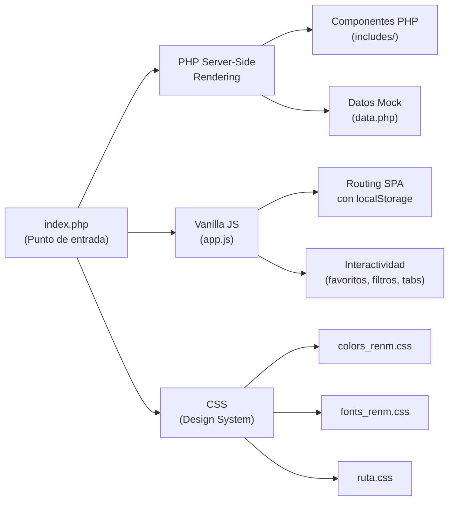
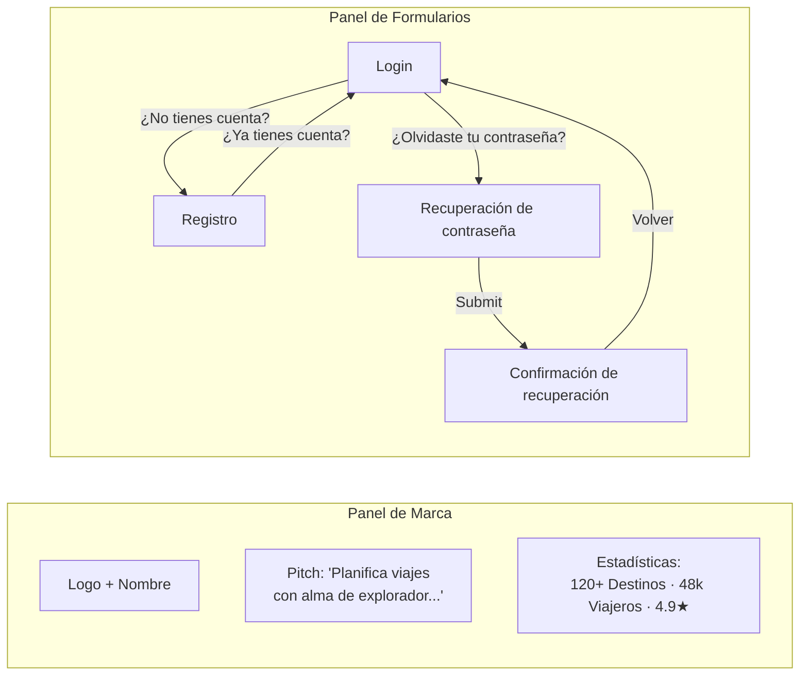
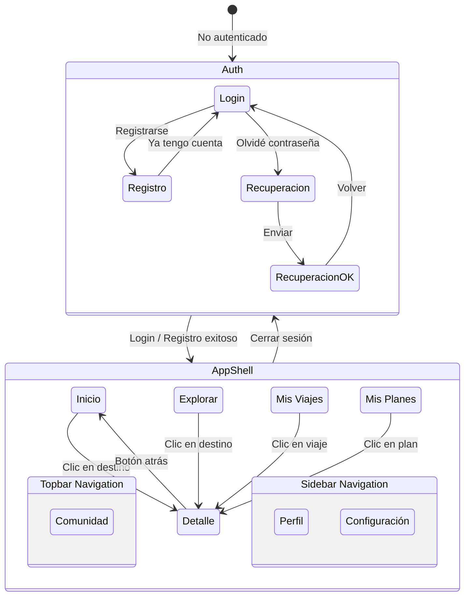

# 📖 Documentación Técnica — Ruta Nómada

> **Proyecto Integrador II · 5.° Cuatrimestre · Universidad Tecnológica**
> Prototipo funcional de una plataforma web para planificación de viajes.

---

## 1. Descripción General

**Ruta Nómada** es un prototipo funcional de una aplicación web de planificación de viajes. Permite a los usuarios explorar destinos turísticos, cotizar rutas, organizar sus viajes, repartir gastos con su grupo y participar en una comunidad de viajeros.

### Características principales

| Funcionalidad | Descripción |
|---|---|
| **Autenticación** | Flujo completo de login, registro y recuperación de contraseña |
| **Exploración** | Catálogo de destinos con filtros por categoría |
| **Mis Viajes** | Panel con viajes activos, confirmados y en planeación |
| **Comunidad** | Feed social con publicaciones, likes y comentarios |
| **Perfil** | Datos personales, actividad y badges del usuario |
| **Configuración** | Notificaciones, preferencias, moneda e idioma |
| **Detalle de destino** | Vista completa con precio, servicios, reseñas y tabs de información |

---

## 2. Arquitectura del Proyecto

El proyecto sigue una arquitectura **híbrida PHP + Vanilla JS**:



### Flujo de renderizado

1. **PHP** genera todo el HTML del lado del servidor (Server-Side Rendering).  
2. Todas las pantallas se renderizan al cargar la página, pero se ocultan con `display:none`.
3. **JavaScript (Vanilla)** se encarga de mostrar/ocultar pantallas, manejar el estado de autenticación y proveer interactividad (filtros, favoritos, tabs, etc.).
4. El estado persiste en `localStorage` (ruta activa, sidebar colapsada, autenticación).

> [!IMPORTANT]
> No se usa ningún framework de JavaScript (ni React, ni Vue, ni Angular). Toda la lógica se maneja con Vanilla JS puro. El proyecto originalmente usaba React + Babel (ver `Ruta Nómada - Prototipo.html` y archivos `.jsx`), pero fue migrado a PHP + Vanilla JS.

---

## 3. Estructura de Archivos

```
Ruta Nómada/
├── index.php                              ← Punto de entrada principal
├── Ruta Nómada - Prototipo.html           ← Versión anterior (React + Babel)
├── Ruta Nómada - Prototipo (standalone).html ← Versión standalone anterior
│
├── css/
│   ├── colors_renm.css                    ← Paleta de colores (Design Tokens)
│   ├── fonts_renm.css                     ← Reglas tipográficas
│   └── ruta.css                           ← Estilos principales de la app
│
├── includes/
│   ├── data.php                           ← Datos mock (destinos, categorías, viajes)
│   ├── components.php                     ← Funciones PHP de componentes reutilizables
│   ├── auth.php                           ← Pantallas de autenticación (login, registro, recuperación)
│   ├── topbar.php                         ← Barra de navegación superior
│   ├── sidebar.php                        ← Barra lateral colapsable
│   ├── footer.php                         ← Pie de página
│   ├── screen_inicio.php                  ← Pantalla: Inicio
│   ├── screen_explorar.php                ← Pantalla: Explorar destinos
│   ├── screen_misviajes.php               ← Pantalla: Mis Viajes
│   ├── screen_comunidad.php               ← Pantalla: Comunidad
│   ├── screen_perfil.php                  ← Pantalla: Perfil (sidebar)
│   ├── screen_misplanes.php               ← Pantalla: Mis Planes (sidebar)
│   ├── screen_config.php                  ← Pantalla: Configuración (sidebar)
│   └── screen_detail.php                  ← Pantalla: Detalle de destino
│
├── js/
│   ├── app.js                             ← Lógica principal (Vanilla JS)
│   ├── app.jsx                            ← (Referencia) Versión React original
│   ├── auth.jsx                           ← (Referencia) Auth en React
│   ├── components.jsx                     ← (Referencia) Componentes React
│   ├── data.jsx                           ← (Referencia) Datos React
│   ├── detail.jsx                         ← (Referencia) Detalle React
│   └── screens.jsx                        ← (Referencia) Pantallas React
│
├── screens_ref/                           ← Imágenes de referencia de las pantallas
│   ├── 01-check.png, 02-check.png, 03-check.png
│   ├── inicio.png
│   └── f7_destino_0.png … f7_destino_5.png
│
└── uploads/                               ← PDFs del diseño y prototipos
    ├── design_system.pdf / Ruta Nómada. Design System.pdf
    ├── f0_inicio.pdf / inicio_antes_del_login.pdf
    ├── f1_registro.pdf / f1_ Registro.pdf
    ├── f2_login.pdf / f2_ login.pdf
    ├── f3_recuperacion.pdf / f3_ Recuperación de contraseña.pdf
    └── f7_destino.pdf / f7_ Detalles del Destino.pdf
```

> [!NOTE]
> Los archivos `.jsx` en la carpeta `js/` son remanentes de la versión anterior del prototipo que usaba React con Babel. **No se usan en la versión actual**; sirven solo como referencia. La versión activa usa `index.php` + `app.js`.

---

## 4. Design System (Sistema de Diseño)

### 4.1 Paleta de Colores

La paleta se define en [colors_renm.css](file:///c:/Users/renm1/Documents/1.%20Neto's%20things/UT/5th%20quarter/Proyecto%20Integrador%20II/Ruta%20Nómada/css/colors_renm.css) y consta de **5 escalas** con 7 tonos cada una (100 a 700):

| Escala | Propósito | Tonos base |
|---|---|---|
| **Barley** | Fondos cream / arena | `#FFF8DE` (500) — Tonos cálidos de crema |
| **Naples** | Acentos cálidos / Botones de acción | `#FAD564` (400) — Dorado/amarillo |
| **Olive** | Badges y estados secundarios | `#B4BD62` (400) — Verde oliva |
| **Neptune** | Elementos UI suaves / Hovers alternativos | `#8EBD9D` (400) — Verde menta |
| **Rino** | Headers, Navbar, Tipografía, Layout | `#1B475D` (400) — Azul profundo |

### 4.2 Tokens Semánticos

En [ruta.css](file:///c:/Users/renm1/Documents/1.%20Neto's%20things/UT/5th%20quarter/Proyecto%20Integrador%20II/Ruta%20Nómada/css/ruta.css) se crean **mapeos semánticos** que abstraen la paleta:

```css
:root {
  /* Superficies */
  --canvas: var(--barley-400);         /* Fondo global de la app */
  --card: var(--barley-600);           /* Superficie de tarjetas */
  --card-hi: var(--barley-700);        /* Superficie más luminosa, inputs */
  --card-border: var(--barley-300);    /* Bordes de tarjetas */

  /* Chrome (navegación) */
  --chrome: var(--rino-400);           /* Navbar / sidebar / footer */
  --chrome-deep: var(--rino-300);      /* Sidebar */

  /* Tinta */
  --ink: var(--rino-100);              /* Texto principal */
  --ink-2: var(--rino-200);            /* Texto secundario */
  --ink-soft: var(--rino-500);         /* Texto suave */

  /* Acciones */
  --cta: var(--naples-400);            /* Call-to-action principal */
  --cta-ink: var(--naples-100);        /* Texto sobre CTA */
  --accent: var(--neptune-400);        /* Botones secundarios */
}
```

### 4.3 Tipografía

Definida en [fonts_renm.css](file:///c:/Users/renm1/Documents/1.%20Neto's%20things/UT/5th%20quarter/Proyecto%20Integrador%20II/Ruta%20Nómada/css/fonts_renm.css). Se usan **3 familias** de Google Fonts:

| Familia | Uso | Pesos |
|---|---|---|
| **Noto Serif** | Encabezados `h1`, `h2`, `h3`, títulos de tarjetas | 600, 700 |
| **Inter** | Texto de cuerpo, botones, inputs, `h4`–`h6` | 400, 500, 600, 700 |
| **Source Code Pro** | Datos financieros, fechas, monedas, badges | 500, 600 |

#### Jerarquía tipográfica:

| Nivel | Tamaño | Familia | Color |
|---|---|---|---|
| `h1` | 2.5rem | Noto Serif | `--rino-400` |
| `h2` | 2rem | Noto Serif | `--rino-300` |
| `h3` | 1.5rem | Noto Serif | `--rino-200` |
| `h4` | 1.25rem | Inter | `--rino-100` |
| `p` | 1rem | Inter | `--rino-100` |
| `.data` | — | Source Code Pro | — |

### 4.4 Layout

| Variable | Valor | Descripción |
|---|---|---|
| `--nav-h` | `68px` | Altura de la barra de navegación superior |
| `--rail-w` | `78px` | Ancho del sidebar cuando está colapsado (icon rail) |
| `--side-w` | `264px` | Ancho del sidebar expandido |
| `--maxw` | `1180px` | Ancho máximo del contenido principal |
| `--radius` | `14px` | Radio de borde estándar |
| `--radius-sm` | `8px` | Radio de borde pequeño |

### 4.5 Sombras

```css
--shadow-sm: 0 1px 2px rgba(7,24,32,.06), 0 2px 8px rgba(7,24,32,.05);
--shadow-md: 0 8px 28px rgba(7,24,32,.10);
--shadow-lg: 0 18px 50px rgba(7,24,32,.18);
```

---

## 5. Componentes PHP Reutilizables

Archivo: [components.php](file:///c:/Users/renm1/Documents/1.%20Neto's%20things/UT/5th%20quarter/Proyecto%20Integrador%20II/Ruta%20Nómada/includes/components.php)

Todas las funciones retornan HTML como string y se invocan con `<?= funcion() ?>`.

### 5.1 `e($str)` — Escape HTML
```php
function e($str) {
    return htmlspecialchars($str, ENT_QUOTES, 'UTF-8');
}
```
Escapa caracteres especiales para prevenir inyección de HTML/XSS.

---

### 5.2 `logoMark($size, $color, $ring)` — Logo (Rosa de los vientos)
```php
logoMark(40)  // SVG del logo a 40px
```
Genera el logo SVG de la brújula/rosa de los vientos. Parámetros opcionales para tamaño, color del diamante y color del anillo.

---

### 5.3 `ico($name, $fill, $className, $style)` — Ícono Material
```php
ico('favorite')           // ícono outline
ico('star', true)         // ícono relleno (filled)
ico('home', false, 'mi-clase', 'font-size:20px')
```
Renderiza un ícono de Google Material Symbols. El parámetro `$fill` activa la variante rellena.

---

### 5.4 `btn($text, $options)` — Botón genérico
```php
btn('Ingresar', [
    'variant'   => 'cta',       // 'cta' | 'secondary' | 'ghost'
    'block'     => true,        // ancho completo
    'type'      => 'submit',    // 'button' | 'submit'
    'icon'      => 'add',       // ícono izquierdo
    'iconRight' => 'arrow_forward', // ícono derecho
    'size'      => 'sm',        // tamaño pequeño
    'extra'     => 'data-auth-go="login"'  // atributos extra
])
```

**Variantes de botón:**

| Variante | Apariencia |
|---|---|
| `cta` | Fondo dorado (`--cta`), texto oscuro. Botón principal de acción. |
| `secondary` | Fondo verde menta (`--accent`). Acciones secundarias. |
| `ghost` | Transparente con borde. Acciones terciarias. |

---

### 5.5 `placeholder($tint, $icon, $label)` — Imagen placeholder
```php
placeholder('agua', 'beach', 'Cancún')
```
Genera un bloque visual con fondo de color, un ícono central grande y opcionalmente una etiqueta. Sustituye las imágenes reales que se usarían en producción.

**Tints disponibles:** `cultura`, `romance`, `aventura`, `desierto`, `agua`, `bosque`, `ciudad`.

Cada tint mapea a un color de la paleta y un ícono por defecto:

| Tint | Color | Ícono por defecto |
|---|---|---|
| `cultura` | Neptune 600 | `temple_buddhist` |
| `romance` | Naples 600 | `wine_bar` |
| `aventura` | Olive 600 | `landscape` |
| `desierto` | Barley 500 | `wb_sunny` |
| `agua` | Neptune 500 | `sailing` |
| `bosque` | Olive 500 | `forest` |
| `ciudad` | Rino 700 | `apartment` |

---

### 5.6 `destinationCard($d, $index)` — Tarjeta de destino
```php
destinationCard($DESTINATIONS[0])
```
Renderiza una tarjeta completa de destino con:
- Imagen placeholder con categoría y botón de favorito
- Nombre del destino y país
- Descripción breve
- Precio y calificación

Los datos del destino se incrustan como JSON en el atributo `data-dest-json` para que JavaScript los lea al hacer clic y abra la vista de detalle.

---

### 5.7 `storyItem($s)` — Elemento "Subido recientemente"
```php
storyItem($STORIES[0])
```
Tarjeta compacta horizontal con thumbnail, fecha, título y autor. Se usa en la sección "Subido recientemente" de la pantalla de Inicio.

---

### 5.8 `tripCard($t)` — Tarjeta de viaje
```php
tripCard($MY_TRIPS[0])
```
Similar a `destinationCard` pero orientada a viajes del usuario. Muestra:
- Estado del viaje con color (Confirmado → verde, Planeando → amarillo, Borrador → gris)
- Fechas del viaje
- Número de viajeros
- Presupuesto

---

## 6. Datos Mock

Archivo: [data.php](file:///c:/Users/renm1/Documents/1.%20Neto's%20things/UT/5th%20quarter/Proyecto%20Integrador%20II/Ruta%20Nómada/includes/data.php)

Define 4 arreglos globales que alimentan todo el contenido del prototipo:

### `$DESTINATIONS` — 8 destinos turísticos

```
Kyoto (Japón), Santorini (Grecia), Patagonia (Argentina), Marruecos,
Cancún (México), Costa Amalfitana (Italia), Bosques de Bavaria (Alemania), Lisboa (Portugal)
```

Cada destino tiene: `name`, `country`, `category`, `tint`, `icon`, `desc`, `price`, `rating`, `fav`.

### `$CATEGORIES` — 6 categorías de filtro

```
Todos, Cultura, Romance, Aventura, Descubrimiento, Playa
```

### `$STORIES` — 4 publicaciones recientes

Publicaciones del feed comunitario con `when`, `title`, `by`, `tint`, `icon`.

### `$MY_TRIPS` — 3 viajes del usuario

Viajes del usuario con `name`, `dates`, `status`, `tint`, `icon`, `budget`, `people`.

---

## 7. Pantallas de la Aplicación

### 7.1 Flujo de Autenticación

Archivo: [auth.php](file:///c:/Users/renm1/Documents/1.%20Neto's%20things/UT/5th%20quarter/Proyecto%20Integrador%20II/Ruta%20Nómada/includes/auth.php)

La autenticación se presenta como un layout de **2 columnas**:



#### Pantallas del flujo:

| ID | Pantalla | Campos |
|---|---|---|
| `auth-login` | Iniciar sesión | Email, Contraseña, Recordar contraseña |
| `auth-registro` | Crear cuenta | Nombre, Email, Contraseña, Confirmar contraseña, Términos |
| `auth-recuperacion` | Recuperación | Email |
| `auth-recuperacion-ok` | Confirmación | (Mensaje de éxito con ícono) |

> [!NOTE]
> El login viene pre-rellenado con `ana@rutanomada.mx` como usuario demo. La autenticación es simulada — solo cambia un flag en `localStorage`.

---

### 7.2 App Shell (Estructura principal)

Archivo: [index.php](file:///c:/Users/renm1/Documents/1.%20Neto's%20things/UT/5th%20quarter/Proyecto%20Integrador%20II/Ruta%20Nómada/index.php) (líneas 40–57)

```
┌──────────────────────────────────────────────────────────────┐
│                      TOPBAR (topbar.php)                     │
│  Logo · Inicio · Explorar · Mis viajes · Comunidad · Search │
├───────────┬──────────────────────────────────────────────────┤
│           │                                                  │
│  SIDEBAR  │               MAIN (contenido)                   │
│           │                                                  │
│  Perfil   │   Se muestra UNA pantalla a la vez:              │
│  Mis plan.│   - screen_inicio                                │
│  Config.  │   - screen_explorar                              │
│           │   - screen_misviajes                              │
│  ─────── │   - screen_comunidad                              │
│  Salir    │   - screen_perfil                                │
│           │   - screen_misplanes                              │
│           │   - screen_config                                │
│           │   - screen_detail                                 │
└───────────┴──────────────────────────────────────────────────┘
```

#### Topbar ([topbar.php](file:///c:/Users/renm1/Documents/1.%20Neto's%20things/UT/5th%20quarter/Proyecto%20Integrador%20II/Ruta%20Nómada/includes/topbar.php))

- Logo con rosa de los vientos SVG
- 4 botones de navegación principal: **Inicio**, **Explorar**, **Mis viajes**, **Comunidad**
- Barra de búsqueda
- Campana de notificaciones + saludo + avatar

#### Sidebar ([sidebar.php](file:///c:/Users/renm1/Documents/1.%20Neto's%20things/UT/5th%20quarter/Proyecto%20Integrador%20II/Ruta%20Nómada/includes/sidebar.php))

- Botón toggle para colapsar/expandir
- Perfil del usuario (avatar + nombre + email)
- Sección "Mi cuenta": **Perfil**, **Mis planes**, **Configuración**
- Botón de "Cerrar sesión"
- Cuando se colapsa, muestra solo íconos con tooltips al hover

---

### 7.3 Pantalla: Inicio

Archivo: [screen_inicio.php](file:///c:/Users/renm1/Documents/1.%20Neto's%20things/UT/5th%20quarter/Proyecto%20Integrador%20II/Ruta%20Nómada/includes/screen_inicio.php)

**Ruta:** `top:inicio`

Contenido:
- Saludo personalizado: "Hola Ana, ¿a dónde vamos?"
- Barra de búsqueda con botón "Filtrar"
- Sección **"Recomendado para ti"** — Chips de categorías + grid de 4 tarjetas de destinos
- Sección **"Subido recientemente"** — Grid de 4 items tipo story

---

### 7.4 Pantalla: Explorar

Archivo: [screen_explorar.php](file:///c:/Users/renm1/Documents/1.%20Neto's%20things/UT/5th%20quarter/Proyecto%20Integrador%20II/Ruta%20Nómada/includes/screen_explorar.php)

**Ruta:** `top:explorar`

Contenido:
- Título: "Explorar destinos"
- **Chips de filtro interactivos**: Todos, Cultura, Romance, Aventura, Descubrimiento, Playa
- Grid de **todos los 8 destinos** (filtrable por categoría)
- Estado vacío: "Sin resultados" cuando ningún destino coincide con el filtro

---

### 7.5 Pantalla: Mis Viajes

Archivo: [screen_misviajes.php](file:///c:/Users/renm1/Documents/1.%20Neto's%20things/UT/5th%20quarter/Proyecto%20Integrador%20II/Ruta%20Nómada/includes/screen_misviajes.php)

**Ruta:** `top:misviajes`

Contenido:
- Título + botón "Nuevo viaje"
- **3 tarjetas de estadísticas**: Viajes activos (3), Confirmado (1), Presupuesto total ($33,300)
- Grid de 3 tarjetas de viaje (con status coloreado)

---

### 7.6 Pantalla: Comunidad

Archivo: [screen_comunidad.php](file:///c:/Users/renm1/Documents/1.%20Neto's%20things/UT/5th%20quarter/Proyecto%20Integrador%20II/Ruta%20Nómada/includes/screen_comunidad.php)

**Ruta:** `top:comunidad`

Contenido:
- Título + botón "Compartir ruta"
- Grid de 4 publicaciones con placeholder visual, autor, fecha, likes y comentarios
- Enlace "Leer" en cada publicación

---

### 7.7 Pantalla: Perfil (Sidebar)

Archivo: [screen_perfil.php](file:///c:/Users/renm1/Documents/1.%20Neto's%20things/UT/5th%20quarter/Proyecto%20Integrador%20II/Ruta%20Nómada/includes/screen_perfil.php)

**Ruta:** `side:perfil`

Contenido:
- Breadcrumb: Cuenta > Perfil
- Hero del perfil: Avatar grande, nombre, rol, badges (Cuenta verificada, Plan Explorador)
- Panel "Datos personales": Nombre, Email, Teléfono, País, Idioma
- Panel "Actividad": Viajes realizados, Rutas guardadas, Reseñas escritas, Gastos repartidos

---

### 7.8 Pantalla: Mis Planes (Sidebar)

Archivo: [screen_misplanes.php](file:///c:/Users/renm1/Documents/1.%20Neto's%20things/UT/5th%20quarter/Proyecto%20Integrador%20II/Ruta%20Nómada/includes/screen_misplanes.php)

**Ruta:** `side:misplanes`

Contenido:
- Breadcrumb: Cuenta > Mis planes
- Título: "Cotizaciones guardadas y borradores de ruta"
- Grid con los mismos 3 viajes del usuario (`$MY_TRIPS`)

---

### 7.9 Pantalla: Configuración (Sidebar)

Archivo: [screen_config.php](file:///c:/Users/renm1/Documents/1.%20Neto's%20things/UT/5th%20quarter/Proyecto%20Integrador%20II/Ruta%20Nómada/includes/screen_config.php)

**Ruta:** `side:config`

Contenido:
- Breadcrumb: Cuenta > Configuración
- Panel **"Notificaciones"** con 4 toggles:
  - Notificaciones por correo ✅
  - Notificaciones push ❌
  - Ofertas y promociones ✅
  - Compartir ubicación ✅
- Panel **"Preferencias"**:
  - Moneda: MXN
  - Idioma: Español
  - Zona horaria: GMT-6
  - Tema oscuro (toggle) ❌
  - Botones: Guardar cambios / Cancelar

---

### 7.10 Pantalla: Detalle del Destino

Archivo: [screen_detail.php](file:///c:/Users/renm1/Documents/1.%20Neto's%20things/UT/5th%20quarter/Proyecto%20Integrador%20II/Ruta%20Nómada/includes/screen_detail.php)

**Ruta:** `detail`

Es una pantalla **dinámica**: el HTML es una plantilla que JavaScript rellena con los datos del destino seleccionado.

#### Layout de 2 columnas:

**Columna izquierda (1.7fr):**
- Hero placeholder (320px de alto)
- Nombre del destino + calificación + opiniones
- Descripción breve
- Badges: país, temperatura, mejor temporada
- **5 tabs**:
  - **Descripción** — Texto largo + grid "Lugares destacados" (4 mini-cards)
  - **Qué hacer** — *Placeholder "Contenido en preparación"*
  - **Dónde comer** — *Placeholder "Contenido en preparación"*
  - **Cómo llegar** — *Placeholder "Contenido en preparación"*
  - **Reseñas** — 2 reseñas de ejemplo

**Columna derecha (1fr, sticky):**
- Panel de precio con botones "Cotizar este viaje" y "Guardar plan"
- Panel "Servicios incluidos": Vuelos redondos, Hotel 5 estrellas, Desayunos, Traslados, Actividades, Asistencia 24/7
- Panel "Información útil": Moneda, Idioma, Voltaje, Emergencias

---

## 8. Lógica JavaScript (app.js)

Archivo: [app.js](file:///c:/Users/renm1/Documents/1.%20Neto's%20things/UT/5th%20quarter/Proyecto%20Integrador%20II/Ruta%20Nómada/js/app.js) (350 líneas)

Todo el código está encapsulado en un **IIFE** (Immediately Invoked Function Expression) para evitar contaminación del scope global.

### 8.1 Utilidades DOM

```javascript
const $ = (sel, ctx) => (ctx || document).querySelector(sel);
const $$ = (sel, ctx) => Array.from((ctx || document).querySelectorAll(sel));
```

### 8.2 Estado de la Aplicación

| Variable | Tipo | Descripción | Persistencia |
|---|---|---|---|
| `route` | `string` | Ruta activa (`top:inicio`, `side:perfil`, `detail`, etc.) | `localStorage('rn_route')` |
| `collapsed` | `boolean` | ¿Sidebar colapsado? | `localStorage('rn_sidebar')` |
| `authed` | `boolean` | ¿Usuario autenticado? | `localStorage('rn_authed')` |
| `currentDest` | `object\|null` | Destino actualmente seleccionado para detalle | No persiste |

### 8.3 Sistema de Routing

El routing es un **SPA simulado** — no cambia la URL del navegador. Se basa en el atributo `data-route` en los botones de navegación:

| Ruta | Pantalla | Origen |
|---|---|---|
| `top:inicio` | Inicio | Topbar |
| `top:explorar` | Explorar | Topbar |
| `top:misviajes` | Mis Viajes | Topbar |
| `top:comunidad` | Comunidad | Topbar |
| `side:perfil` | Perfil | Sidebar |
| `side:misplanes` | Mis Planes | Sidebar |
| `side:config` | Configuración | Sidebar |
| `detail` | Detalle del destino | Clic en tarjeta |

**Convención:** Los prefijos `top:` y `side:` determinan cuál barra de navegación marca el ítem como activo.

#### Flujo de `navigateTo()`:
1. Actualiza la variable `route`
2. Guarda en `localStorage`
3. Llama a `render()`
4. Hace scroll al inicio del contenido

### 8.4 Función `render()` — Renderizado principal

Esta es la función central que sincroniza el DOM con el estado:

```
render()
├── Si NO autenticado:
│   ├── Mostrar auth-flow
│   ├── Ocultar app-shell
│   └── Mostrar card de login
├── Si autenticado:
│   ├── Ocultar auth-flow
│   ├── Mostrar app-shell
│   ├── Mostrar/ocultar screens según route activo
│   ├── Actualizar estado activo de botones topbar
│   ├── Actualizar estado activo de links sidebar
│   └── Actualizar estado colapsado del sidebar
```

### 8.5 Flujo de Autenticación (JS)

| Acción | Función | Comportamiento |
|---|---|---|
| Login | `enterApp()` | Pone `authed = true`, navega a `top:inicio` |
| Registro | `enterApp()` | Mismo que login (requiere checkbox de términos) |
| Recuperación | Muestra card `recuperacion-ok` | Muestra email ingresado |
| Logout | `logout()` | Pone `authed = false`, muestra pantalla de login |
| Navegación entre cards | `showAuthCard(mode)` | Oculta todas las auth cards, muestra la indicada |

### 8.6 Interactividad

#### Toggle de contraseña visible
- Selector: `[data-pw-toggle]`
- Alterna el `type` del input entre `password` y `text`
- Cambia el ícono entre `visibility` y `visibility_off`

#### Favoritos
- Selector: `[data-fav-btn]`
- Alterna la clase `on` (ícono de corazón relleno vs. outline)
- Previene la propagación del clic (no abre el detalle)

#### Filtro por categoría (Explorar)
- Selector: `[data-cat-filter]`
- Filtra las tarjetas de destinos comparando `data-category` de cada `[data-dest-card]`
- Si `cat === 'todos'`, muestra todas
- Muestra/oculta el mensaje "Sin resultados" según haya coincidencias

#### Detalle del destino
- Clic en `[data-dest-card]` → Lee `data-dest-json` → `populateDetail()` → `render()`
- La función `populateDetail()` rellena todos los elementos del template con los datos del destino
- Genera el placeholder hero dinámicamente con `buildPlaceholder()`

#### Tabs del detalle
- Selector: `[data-detail-tab]`
- Muestra el panel correspondiente (`tab-desc`, `tab-resenas`, `tab-placeholder`)
- Actualiza estilos de los botones de tab (activo: negrita + subrayado dorado)

#### Toggles de configuración
- Selector: `[data-toggle]`
- Alterna la clase `on` y el atributo `aria-pressed`

#### Sidebar colapsable
- Botón: `#sidebar-toggle`
- Alterna la clase `collapsed` en `#sidebar`
- Cambia el ícono entre `menu_open` y `menu`
- Muestra/oculta el perfil del usuario

### 8.7 Animación `reanimate()`

```javascript
function reanimate(el) {
    el.classList.remove('fade');
    void el.offsetWidth;    // force reflow
    el.classList.add('fade');
}
```

Se usa la animación CSS `fadeUp` (0.32s) para dar un efecto de entrada suave cada vez que se muestra una pantalla o un panel.

---

## 9. Hojas de Estilo CSS

### Organización de [ruta.css](file:///c:/Users/renm1/Documents/1.%20Neto's%20things/UT/5th%20quarter/Proyecto%20Integrador%20II/Ruta%20Nómada/css/ruta.css) (482 líneas)

| Sección | Líneas | Contenido |
|---|---|---|
| Variables `:root` | 1–40 | Tokens semánticos, layout, sombras |
| Reset + Base | 42–66 | Box-sizing, Material Icons, scrollbar |
| Data Tokens | 76–87 | Clases `.data`, `.badge-data` |
| Botones | 89–104 | `.btn`, variantes `--cta`, `--secondary`, `--ghost` |
| Form Fields | 106–141 | `.field`, `.check`, estados focus/error |
| Auth Screens | 143–195 | Layout 2 columnas, brand panel, formularios |
| App Shell | 197–328 | Topbar, sidebar, main, breadcrumbs |
| Contenido | 330–467 | Page heads, chips, grids, cards, stories, panels, toggles, stats, footer, profile |
| Animaciones | 468–470 | `@keyframes fadeUp` + clase `.fade` |
| Responsive | 472–481 | Breakpoints 900px y 560px |

### Media Queries (Responsive)

```css
@media (max-width: 1100px) {
  /* Grids de 4 y 3 columnas → 2 columnas */
}
@media (max-width: 900px) {
  /* Ocultar navegación topbar, reducir searchbox y padding */
}
@media (max-width: 720px) {
  /* Todos los grids → 1 columna */
}
@media (max-width: 560px) {
  /* Auth: 1 columna, ocultar panel de marca */
}
```

---

## 10. Cómo Ejecutar el Proyecto

### Requisitos previos

- **PHP** ≥ 7.4 instalado en el sistema
- Un navegador web moderno (Chrome, Firefox, Edge)
- Conexión a Internet (para cargar Google Fonts y Material Icons)

### Opción 1: Servidor PHP integrado (recomendado)

```bash
cd "Ruta Nómada"
php -S localhost:8000
```

Luego abrir en el navegador: `http://localhost:8000`

### Opción 2: XAMPP / WAMP / MAMP

1. Copiar la carpeta `Ruta Nómada` dentro de la carpeta `htdocs` (XAMPP) o `www` (WAMP).
2. Iniciar Apache.
3. Navegar a `http://localhost/Ruta Nómada/`.

### Opción 3: Versión estática (solo HTML)

El archivo `Ruta Nómada - Prototipo (standalone).html` es una versión standalone que puede abrirse directamente en el navegador sin necesidad de servidor. Sin embargo, esta versión usa React + Babel y es anterior a la versión PHP actual.

> [!TIP]
> Al iniciar la app, aparecerá la pantalla de login. El email pre-rellenado es `ana@rutanomada.mx`. Solo haz clic en "Ingresar" para entrar al dashboard. La contraseña puede ser cualquier cosa — la autenticación es simulada.

---

## 11. Glosario Técnico

| Término | Significado |
|---|---|
| **IIFE** | Immediately Invoked Function Expression — función JS que se ejecuta al definirse |
| **SPA** | Single Page Application — toda la navegación ocurre sin recargar la página |
| **SSR** | Server-Side Rendering — el HTML se genera en el servidor (PHP en este caso) |
| **Design Tokens** | Variables CSS que representan decisiones de diseño (colores, espaciados, tipografía) |
| **Semantic Mapping** | Mapeo entre tokens de diseño y su propósito funcional (ej: `--cta` para el botón principal) |
| **Icon Rail** | Sidebar colapsado que muestra solo íconos |
| **Placeholder** | Bloque visual que sustituye imágenes reales en el prototipo |
| **Chip** | Botón pequeño redondeado usado para filtros de categoría |
| **Breadcrumb** | Ruta de navegación tipo "Cuenta > Perfil" |
| **Mock Data** | Datos ficticios usados para demostrar la funcionalidad |

---

## 12. Diagrama de Navegación Completo



---

> **Última actualización:** Junio 2026
