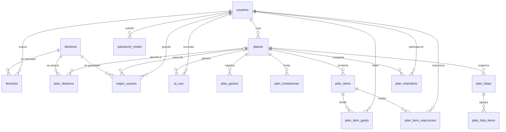
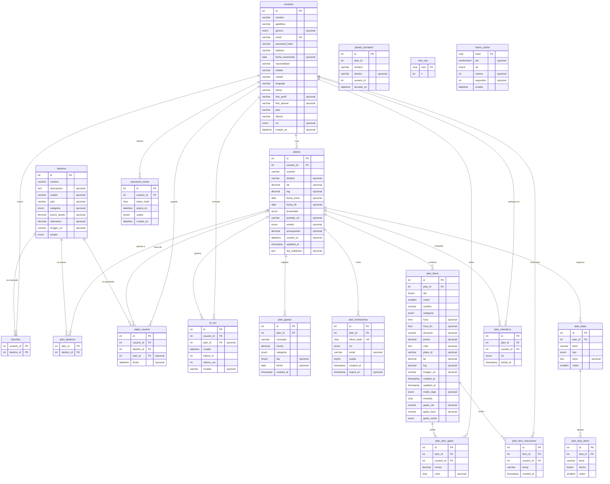

# Diagrama EER - base de datos `ruta_nomada`

Modelo entidad-relacion extendido de Ruta Nomada, generado **a partir
del esquema real** consultando `information_schema`, no dibujado a mano.

- **19 entidades** - **144 atributos** - **22 relaciones**
- Motor InnoDB - MariaDB 10.4.32
- Script de creacion: `basedatos/instalar.sql`

> **Como verlo.** Los diagramas estan en formato Mermaid y se dibujan
> solos en GitHub, en la vista previa de VS Code (extension *Markdown
> Preview Mermaid*) y en <https://mermaid.live>. Para el diagrama nativo
> de MySQL Workbench, ver el apartado 6.

---

## 1. Mapa de relaciones

Vista de conjunto sin atributos: como se conectan las 19 tablas.

**Como leer la notacion (pata de gallo):**

| Simbolo | Significado |
|---------|-------------|
| `\|\|` | exactamente uno |
| `\|o` | cero o uno *(la clave foranea admite NULL)* |
| `o{` | cero o muchos |

Ejemplo: `usuarios ||--o{ planes` se lee **"un usuario crea de cero a
muchos planes, y todo plan pertenece exactamente a un usuario"**.

---

## 2. Diagrama completo con atributos

Todas las entidades con sus columnas, tipos y claves.
`PK` = clave primaria - `FK` = clave foranea - `UK` = clave unica.

---

## 3. Las 22 relaciones en detalle

Que ocurre con las filas hijas cuando se borra la fila padre:

| Entidad padre | Clave foranea | Cardinalidad | Al borrar el padre | Admite NULL |
|---------------|---------------|--------------|--------------------|--------------|
| `destinos` | `favoritos.destino_id` | 1 : 0..N | `CASCADE` | no |
| `destinos` | `plan_destinos.destino_id` | 1 : 0..N | `CASCADE` | no |
| `destinos` | `viajes_usuario.destino_id` | 1 : 0..N | `RESTRICT` | no |
| `planes` | `ai_uso.plan_id` | 1 : 0..N | `SET NULL` | si |
| `planes` | `plan_destinos.plan_id` | 1 : 0..N | `CASCADE` | no |
| `planes` | `plan_gastos.plan_id` | 1 : 0..N | `CASCADE` | no |
| `planes` | `plan_invitaciones.plan_id` | 1 : 0..N | `CASCADE` | no |
| `planes` | `plan_items.plan_id` | 1 : 0..N | `CASCADE` | no |
| `planes` | `plan_listas.plan_id` | 1 : 0..N | `CASCADE` | no |
| `planes` | `plan_miembros.plan_id` | 1 : 0..N | `CASCADE` | no |
| `planes` | `viajes_usuario.plan_id` | 1 : 0..N | `SET NULL` | si |
| `plan_items` | `plan_item_gasto.item_id` | 1 : 0..N | `CASCADE` | no |
| `plan_items` | `plan_item_reacciones.item_id` | 1 : 0..N | `CASCADE` | no |
| `plan_listas` | `plan_lista_items.lista_id` | 1 : 0..N | `CASCADE` | no |
| `usuarios` | `ai_uso.usuario_id` | 1 : 0..N | `CASCADE` | no |
| `usuarios` | `favoritos.usuario_id` | 1 : 0..N | `CASCADE` | no |
| `usuarios` | `password_resets.usuario_id` | 1 : 0..N | `CASCADE` | no |
| `usuarios` | `planes.usuario_id` | 1 : 0..N | `CASCADE` | no |
| `usuarios` | `plan_item_gasto.usuario_id` | 1 : 0..N | `CASCADE` | no |
| `usuarios` | `plan_item_reacciones.usuario_id` | 1 : 0..N | `CASCADE` | no |
| `usuarios` | `plan_miembros.usuario_id` | 1 : 0..N | `CASCADE` | no |
| `usuarios` | `viajes_usuario.usuario_id` | 1 : 0..N | `RESTRICT` | no |

**Las excepciones al `CASCADE`** estan puestas a proposito:

- **`ai_uso.plan_id` -> `SET NULL`.** El contador de consumo de la IA no
  debe borrarse al borrar un viaje: sirve para controlar el gasto del
  usuario a lo largo del tiempo.
- **`viajes_usuario.plan_id` -> `SET NULL`.** Es el historial de destinos
  que el usuario guardo. Al borrar un plan se rompe el vinculo, pero el
  recuerdo del destino se conserva.
- **`viajes_usuario.usuario_id` y `.destino_id` -> `RESTRICT`.** Impiden
  borrar un usuario o un destino que todavia tenga historial asociado.

Y una tabla **sin ninguna clave foranea, tambien a proposito**:
`planes_borrados` es el archivo de auditoria del borrado, y su fila debe
**sobrevivir** al plan que registra. Una clave foranea la borraria en
cascada, justo lo contrario de lo que se busca.

---

## 4. Las entidades por familia

| Familia | Entidades | Para que |
|---------|-----------|----------|
| Personas | `usuarios`, `password_resets` | Quien entra al sistema |
| Catalogo | `destinos`, `favoritos`, `viajes_usuario` | Destinos que ofrece la app |
| El viaje | `planes`, `plan_items`, `plan_gastos` | El corazon del sistema |
| Compartir | `plan_miembros`, `plan_invitaciones`, `plan_item_reacciones`, `plan_item_gasto` | Viajar acompanado |
| Organizar | `plan_listas`, `plan_lista_items`, `plan_destinos` | Notas y pendientes |
| Servicio | `tramo_cache`, `ruta_uso`, `ai_uso`, `planes_borrados` | Ahorro, control y auditoria |

El proposito de cada tabla esta desarrollado en `REPORTE_base_de_datos.md`.

---

## 5. Las cuatro tablas puente

Las relaciones de muchos a muchos no se pueden representar directamente
entre dos tablas: necesitan una tabla intermedia. En este modelo hay
cuatro, y conviene senalarlas porque son la parte del diseno que mas
suele evaluarse:

| Tabla puente | Conecta | Dato extra que aporta |
|--------------|---------|------------------------|
| `favoritos` | `usuarios` <-> `destinos` | ninguno (clave primaria compuesta) |
| `plan_destinos` | `planes` <-> `destinos` | ninguno (clave primaria compuesta) |
| `plan_miembros` | `usuarios` <-> `planes` | el **rol** (propietario / editor / lector) |
| `plan_item_gasto` | `usuarios` <-> `plan_items` | el **importe** que le toca a cada uno |

Las dos primeras son puentes puros: solo unen. Las dos ultimas llevan un
atributo propio en la relacion -el rol y el importe-, que es justo lo que
obliga a que existan como entidad y no como un simple par de columnas.

---

## 6. Generar el diagrama nativo de MySQL Workbench

Este documento es el modelo en Mermaid, versionable junto al codigo. Si
se necesita el diagrama EER **de Workbench** -el de las cajas con las
lineas de patas de gallo-, se obtiene en cuatro pasos:

1. Abrir MySQL Workbench y conectar a `127.0.0.1:3306`, usuario `root`,
   contrasena vacia.
2. Menu **Database -> Reverse Engineer...** (`Ctrl+R`).
3. Pulsar *Next* hasta la lista de esquemas, marcar **`ruta_nomada`** y
   seguir hasta *Execute*.
4. Al terminar aparece la pestana **EER Diagram** con las 19 tablas y sus
   relaciones dibujadas.

Un par de avisos:

- Workbench mostrara *"Incompatible/nonstandard server version detected
  (10.4.32-MariaDB)"*. Se puede continuar: la ingenieria inversa
  funciona con normalidad.
- El diagrama sale con las tablas amontonadas. Conviene arrastrarlas y
  agruparlas por familias (apartado 4) antes de exportarlo con
  **File -> Export -> Export as PNG/SVG**.

---

*Generado a partir del estado real de la base `ruta_nomada`. Si el
esquema cambia, este archivo hay que regenerarlo para que no mienta.*
