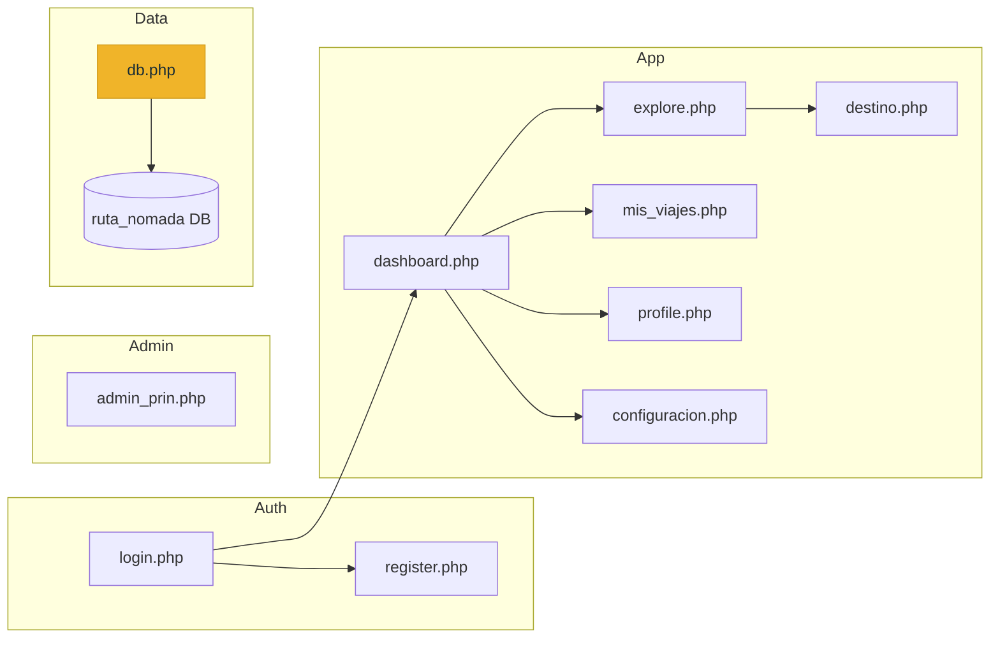

# Project Analysis: intre proyecto_viajes (update-Natalia)

## 1. Architecture Overview



| Layer | Technology |
|---|---|
| Backend | PHP 8.2 (XAMPP) |
| Database | MariaDB 10.4 via PDO |
| Frontend | Vanilla HTML/CSS, emoji icons |
| Fonts | Playfair Display + DM Sans |
| Maps | Google Maps JS API (single static marker) |
| Auth | Session-based with `password_hash` / `password_verify` |

---

## 2. Pages & Functionalities

| Page | Purpose | DB Tables Used | Status |
|---|---|---|---|
| [login.php](file:///c:/xampp/htdocs/intre%20proyecto_viajes%20(update-Natalia)/login.php) | Login with email/password, "remember me" cookie | `usuarios` | ✅ Working |
| [register.php](file:///c:/xampp/htdocs/intre%20proyecto_viajes%20(update-Natalia)/register.php) | Account creation with validation, auto-login | `usuarios` | ✅ Working |
| [dashboard.php](file:///c:/xampp/htdocs/intre%20proyecto_viajes%20(update-Natalia)/dashboard.php) | Home: recommended destinations by category + recent activity | `destinos` | ✅ Working |
| [explore.php](file:///c:/xampp/htdocs/intre%20proyecto_viajes%20(update-Natalia)/explore.php) | Browse all destinations with category filter + Google Map | `destinos` | ✅ Working |
| [destino.php](file:///c:/xampp/htdocs/intre%20proyecto_viajes%20(update-Natalia)/destino.php) | Destination detail: description, price, "save trip" via AJAX | `destinos`, `viajes_usuario` | ✅ Working |
| [mis_viajes.php](file:///c:/xampp/htdocs/intre%20proyecto_viajes%20(update-Natalia)/mis_viajes.php) | User's saved trips list | `viajes_usuario`, `destinos`, `planes` | ⚠️ Broken (needs `plan_id` column) |
| [profile.php](file:///c:/xampp/htdocs/intre%20proyecto_viajes%20(update-Natalia)/profile.php) | User info display (read-only) | `usuarios` | ✅ Working (but static stats) |
| [configuracion.php](file:///c:/xampp/htdocs/intre%20proyecto_viajes%20(update-Natalia)/configuracion.php) | Notification/preference toggles | None | ⚠️ Static (no save logic) |
| [admin_prin.php](file:///c:/xampp/htdocs/intre%20proyecto_viajes%20(update-Natalia)/admin_prin.php) | Admin CRUD table for destinations with search/filter | `destinos` | ⚠️ Partial (Edit/Delete are `#` links) |

---

## 3. Weaknesses & Bugs

### 🔴 Critical

| # | Issue | File | Line |
|---|---|---|---|
| 1 | **`viajes_usuario` table missing `plan_id` column** — causes fatal error on Mis Viajes | [mis_viajes.php](file:///c:/xampp/htdocs/intre%20proyecto_viajes%20(update-Natalia)/mis_viajes.php) | 25 |
| 2 | **Duplicate `getDB()` definition** inside register.php — the file re-defines `getDB()` and `checkDBConnection()` with *different* password logic than `db.php`. If `db.php` is ever loaded first, the duplicate is silently skipped. If not, it uses env vars instead of hardcoded values, causing inconsistency | [register.php](file:///c:/xampp/htdocs/intre%20proyecto_viajes%20(update-Natalia)/register.php) | 8–49 |
| 3 | **`destinos` table missing `tag` column** — `explore.php` and `dashboard.php` reference `$d['tag']` but the column doesn't exist in the DB schema. PHP notice / blank tag on cards | [explore.php](file:///c:/xampp/htdocs/intre%20proyecto_viajes%20(update-Natalia)/explore.php) | 122 |
| 4 | **`destinos` table missing `estado` column** — `admin_prin.php` queries `estado` but the schema has no such column → SQL error | [admin_prin.php](file:///c:/xampp/htdocs/intre%20proyecto_viajes%20(update-Natalia)/admin_prin.php) | 49, 60 |
| 5 | **Logout runs after page renders** — the `?logout=1` check is placed *after* the page HTML variables are set (line 48), meaning session data is used before being destroyed | [dashboard.php](file:///c:/xampp/htdocs/intre%20proyecto_viajes%20(update-Natalia)/dashboard.php) | 48 |

### 🟡 Moderate

| # | Issue | Details |
|---|---|---|
| 6 | **No role-based access control** — `admin_prin.php` has no admin check; any logged-in user can access it | 
| 7 | **Google Maps is hardcoded to Kyoto** — the map always shows the same location regardless of which destination is being browsed |
| 8 | **Category filter uses repeated `if` blocks** instead of a single parameterized query — same code block copy-pasted 5 times | [explore.php](file:///c:/xampp/htdocs/intre%20proyecto_viajes%20(update-Natalia)/explore.php) L19–41, [dashboard.php](file:///c:/xampp/htdocs/intre%20proyecto_viajes%20(update-Natalia)/dashboard.php) L25–40 |
| 9 | **Profile data is hardcoded** — "7 viajes, 12 rutas, 18 reseñas" are static strings, not from DB |
| 10 | **Configuración doesn't save** — checkboxes and buttons have no form action or backend logic |
| 11 | **Login form has empty disabled attributes** — `<?= $error_db ? : '' ?>` outputs `1` instead of `disabled` | [login.php](file:///c:/xampp/htdocs/intre%20proyecto_viajes%20(update-Natalia)/login.php) L165, 182, 198, 210 |

### 🟢 Minor / Polish

| # | Issue |
|---|---|
| 12 | Search bars are `readonly` or have no backend handler — purely decorative |
| 13 | "Comunidad" nav link points to `#` — no community page exists |
| 14 | "forgot-password.php" is linked but doesn't exist |
| 15 | Topbar/sidebar HTML is duplicated in every PHP file instead of using shared includes |
| 16 | No CSRF protection on any form |
| 17 | Prices display as raw numbers (e.g., `24800.00`) without currency formatting |
| 18 | `destinos` has no `Playa` enum value, but explore.php has a "Playa" category filter button |

---

## 4. Proposed Improvements

### Quick Wins
1. **Add missing columns** to `destinos`: `tag VARCHAR(50)`, `estado ENUM('activo','inactivo') DEFAULT 'activo'`
2. **Add `plan_id`** to `viajes_usuario`
3. **Remove duplicate `getDB()`** from register.php (lines 8–49)
4. **Move logout check** to the top of dashboard.php (before any output)
5. **Fix login.php disabled attributes**: `<?= $error_db ? 'disabled' : '' ?>`
6. **Format prices**: `$<?= number_format($d['precio_desde'], 0, '.', ',') ?> MXN`

### Structural Improvements
7. **Extract shared partials**: `includes/topbar.php`, `includes/sidebar.php`, `includes/head.php`
8. **Simplify category query** to a single `if/else` block
9. **Add admin role check** in admin_prin.php: `if ($user['rol'] !== 'admin') { ... }`
10. **Make the Google Map dynamic** — center on each destination's lat/lng (requires adding `lat`/`lng` columns to `destinos`)

---

## 5. Frankfurter API — Where to Implement It

### Recommendation: **`destino.php`** (Destination Detail Page)

This is the **highest-impact location** for both UX and UI because:

1. **Context is perfect** — The user is already looking at a specific destination with a price tag (`$24,800 MXN`). This is the moment they naturally wonder *"how much is that in my currency?"*
2. **All prices are in MXN** — The database stores `precio_desde` as a decimal with no currency indicator. A converter here answers the user's most pressing question.
3. **The page has a sidebar panel with space** — The right-side booking panel ([destino.php L92–100](file:///c:/xampp/htdocs/intre%20proyecto_viajes%20(update-Natalia)/destino.php#L92-L100)) already shows the price. A converter widget fits naturally below it.
4. **No page reload needed** — The Frankfurter API is called from JavaScript, so conversion happens instantly.

### Proposed UI Placement

```
┌─────────────────────────────────┐
│  Precio desde · por persona     │
│  $24,800 MXN                    │
│                                 │
│  ┌──────────────────────────┐   │
│  │ 💱 Convertir a:          │   │
│  │ [USD ▾]                  │   │
│  │                          │   │
│  │ ≈ $1,367.40 USD          │   │
│  │ Tasa: 1 MXN = 0.0552 USD│   │
│  │ Actualizado: Hoy         │   │
│  └──────────────────────────┘   │
│                                 │
│  [  Cotizar este viaje  ]       │
│  [  Guardar plan        ]       │
└─────────────────────────────────┘
```

### Why NOT Other Pages

| Page | Why not |
|---|---|
| `dashboard.php` | Shows multiple cards — adding a converter to each would be cluttered and overwhelming |
| `explore.php` | Same issue — it's a grid of many small cards; the map already takes up space |
| `configuracion.php` | The "Moneda: MXN" preference is static and unrelated to live conversion |
| `mis_viajes.php` | Trips don't display prices currently |

### Secondary placement (optional enhancement)

If you want *additional* coverage, `explore.php` could show a small "💱 Ver en USD" toggle at the top of the cards grid that batch-converts all visible prices. But `destino.php` should be the primary integration.

### API Integration Pattern

The Frankfurter API requires no API key and works directly from client-side JavaScript:

```javascript
// Example: Convert MXN price to selected currency
async function convertPrice(amountMXN, targetCurrency) {
    const res = await fetch(
        `https://api.frankfurter.dev/v2/rate/MXN/${targetCurrency}`
    );
    const data = await res.json();
    return (amountMXN * data.rate).toFixed(2);
}
```

> [!TIP]
> The API supports **201 currencies** from **84 central banks**, no authentication required, and updates daily. The most relevant currencies for a Mexican travel platform would be: **USD, EUR, GBP, CAD, JPY, BRL, COP, ARS**.

---

## 6. Summary Scorecard

| Aspect | Score | Notes |
|---|---|---|
| **Core functionality** | 7/10 | Auth, browse, save trips works; some pages broken |
| **Code quality** | 5/10 | Heavy duplication, missing includes, duplicate function definitions |
| **Database design** | 6/10 | Schema inconsistencies (missing columns vs. code expectations) |
| **Security** | 4/10 | No CSRF, no admin role check, API key exposed in HTML |
| **UX completeness** | 5/10 | Several static/placeholder features (search, config, profile stats) |
| **Visual design** | 7/10 | Clean teal/gold palette, good typography, responsive layout |
| **API integration** | 3/10 | Only Maps API, hardcoded to one location |
